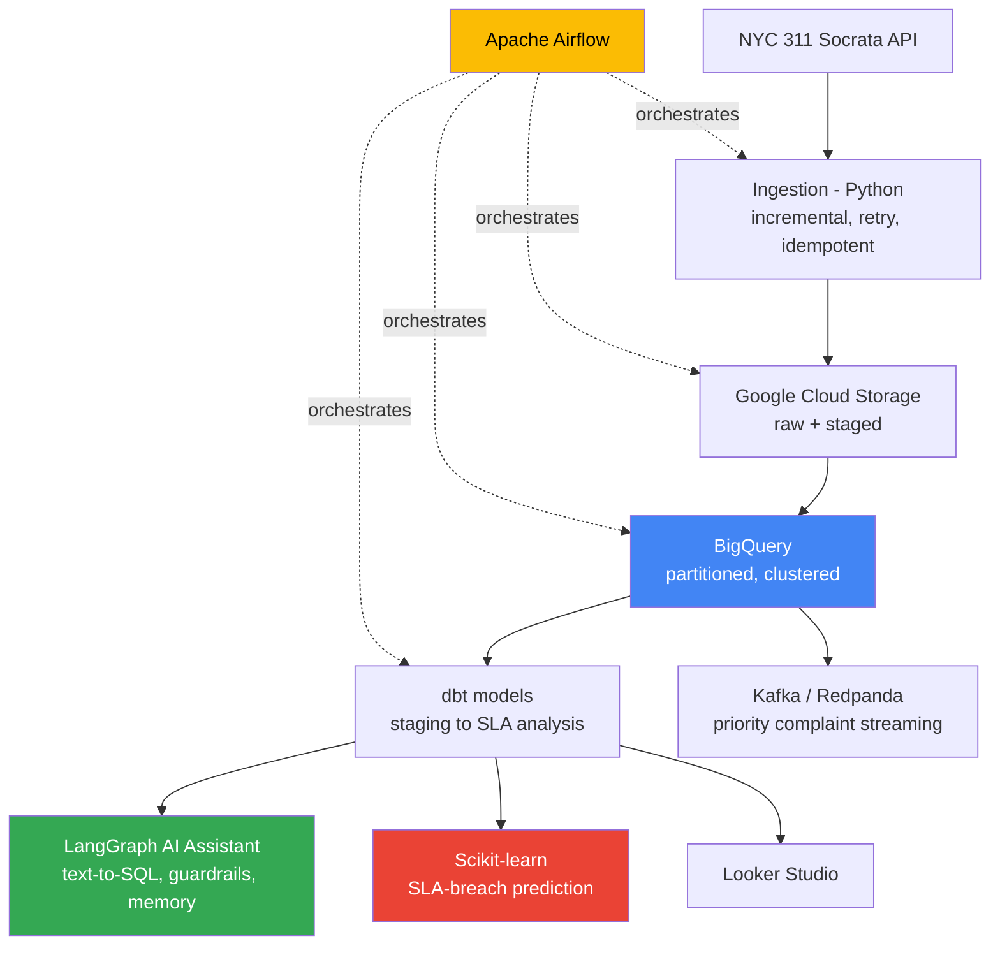

# NYC 311 Data Engineering & AI Platform
An end-to-end data engineering and AI platform built on live NYC 311 complaint
data -- from raw ingestion through a natural-language AI assistant, a
predictive ML model, and real-time streaming, fully orchestrated and
automated. Built entirely on free-tier and open-source tooling.

**Live pipeline -> real BigQuery warehouse -> dbt models -> Airflow orchestration
-> LangGraph AI assistant with SQL guardrails -> Scikit-learn SLA prediction ->
Kafka streaming -> CI on every push.**

---

## Why this project

Most portfolio projects pick one lane: data engineering *or* AI. This one
does both, deliberately, because that's what the job market is actually
asking for -- pipelines that feed intelligent systems, not pipelines and AI
as separate concerns. Every design decision below was made, tested, and in
several cases *broken and fixed* -- with the debugging process documented,
not hidden.

## Architecture

## The five systems

### 1. Data Platform
Incremental, idempotent ingestion from the NYC 311 Socrata API into Google
Cloud Storage, then BigQuery -- partitioned by day, clustered by complaint
type and borough. Retry logic with exponential backoff; state tracked so a
crashed run never duplicates or loses data.
-> [`docs/ingestion_design.md`](docs/ingestion_design.md)

### 2. Transformation & Orchestration
dbt models (staging -> SLA-breach analysis -> live at-risk detection) with 8
automated data quality tests. Apache Airflow orchestrates the full pipeline
-- ingest -> transform -> load -> dbt run -> dbt test -- on a daily schedule,
running entirely in Docker.

### 3. Real-Time Pipeline
A Kafka/Redpanda producer streams high-priority complaints (water, gas,
heat, structural issues) as they're ingested, with a consumer processing
them independently of the daily batch schedule -- a genuine event-driven
layer alongside the batch pipeline.

### 4. AI Operations Assistant
A LangGraph-orchestrated agent that turns natural-language questions into
validated SQL against the live warehouse:
- Schema-grounded text-to-SQL generation (Llama 3.1, run locally via Ollama)
- Independent, code-level SQL validation -- SELECT-only enforcement,
  forbidden-keyword blocklist, table allowlist, automatic row-limit capping
- Self-correcting retry loop: a rejected query is regenerated with the
  validation error as feedback
- Multi-turn conversational memory for follow-up questions
- **Found and fixed a real validator gap through adversarial testing** --
  documented as a postmortem, not hidden

### 5. ML & Analytics
A Scikit-learn model predicting SLA-breach risk *before* a complaint is
resolved, trained only on features genuinely available at creation time
(no data leakage). Evaluated honestly -- including a threshold analysis that
correctly concluded feature quality, not calibration, is the real
bottleneck -- with concrete next steps documented rather than a padded
accuracy number.
-> [`docs/ml_model_design.md`](docs/ml_model_design.md)

## Engineering practices worth noting

- **Idempotency by design, not retrofit** -- every write stage (ingest,
  transform, load) tracks its own state and is safe to re-run
- **Local-first development, zero cloud cost during iteration** -- Floci
  (AWS/GCP emulation) and Ollama (local LLM) mean the entire dev loop runs
  free; only final verification touches real GCP infrastructure
- **Documented postmortems, not just clean commits** -- two real bugs (a
  BigQuery duplicate-load issue, a SQL validator gap found via adversarial
  testing) are written up with root cause and fix, not swept under the rug
- **CI on every push** -- automated linting and syntax verification via
  GitHub Actions

## Tech stack

**Data engineering:** Python, Google Cloud Storage, BigQuery, dbt, Apache
Airflow, Docker
**Streaming:** Kafka / Redpanda
**AI:** LangChain, LangGraph, Ollama (Llama 3.1), schema-grounded RAG/text-to-SQL
**ML:** Scikit-learn, pandas
**Local emulation:** Floci (AWS + GCP emulator)
**CI/CD:** GitHub Actions, ruff

## Project structure

    src/                 Pipeline, AI assistant, ML, and Kafka code
    nyc311_dbt/          dbt models, tests, and schema definitions
    airflow/             Airflow DAG and Docker Compose setup
    docs/                Design decisions and postmortems
    .github/workflows/   CI configuration

## Design documentation

- [`docs/ingestion_design.md`](docs/ingestion_design.md) -- ingestion
  architecture, idempotency mechanisms, and the BigQuery duplicate-load
  postmortem
- [`docs/ml_model_design.md`](docs/ml_model_design.md) -- SLA-breach model
  design, honest evaluation, and threshold analysis

---

Built as a portfolio project demonstrating end-to-end data engineering and
agentic AI, developed entirely on free-tier and open-source infrastructure.